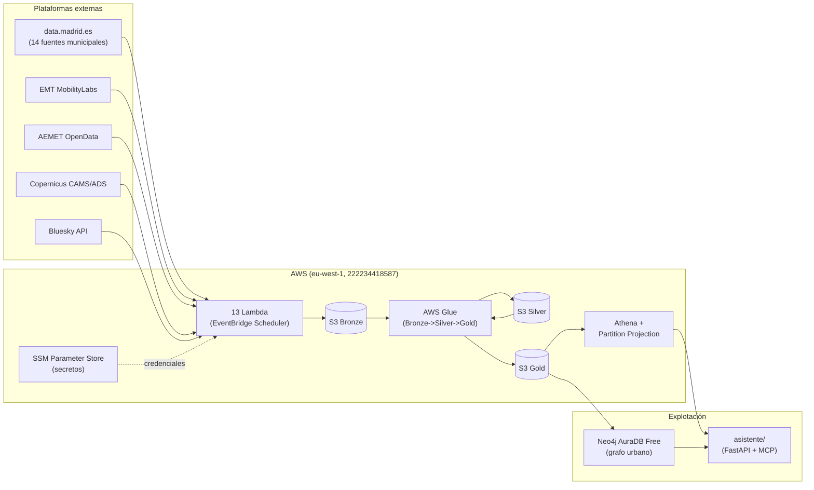

# Esquema de plataformas y arquitectura — Madroño TFM

Inventario de todo servicio AWS y plataforma externa en uso, con su
propósito, estado y coste. Punto en el tiempo: **25 de agosto de 2026**,
verificado contra la cuenta AWS real (`222234418587`, `eu-west-1`) y contra
el código de `infra/terraform/`. Complementa
[`PLAN.md`](PLAN.md#reparto-sin-conflictos) (qué pista es dueña de cada
carpeta) y [`doc/001`](doc/001-infraestructura-aws-terraform.md)–
[`doc/029`](doc/029-terraform-lambda-eventbridge-plan.md) (por qué se
decidió cada pieza).

## Diagrama de flujo de datos

## Inventario AWS

| Servicio | Recurso(s) | Propósito | Estado (25/8) |
|---|---|---|---|
| **S3** | `madrono-tfm-dev-bronze-*` | Datos crudos, sin transformar, partición `fecha=/hora=` | 12.169 objetos reales |
| | `madrono-tfm-dev-silver-*` | Datos limpios/validados, Parquet | 17.619 objetos reales |
| | `madrono-tfm-dev-gold-*` | Datos agregados para consulta (Athena/grafo) | 1.343 objetos reales; 2 tablas vacías (ver riesgos) |
| | `madrono-tfm-dev-athena-results-*` | Resultados de consultas Athena | — |
| | `madrono-tfm-dev-build-artifacts-*` | Artefactos de build de la Lambda layer (CodeBuild) | — |
| | `madrono-tfm-terraform-state` | Estado remoto de Terraform (backend S3 + lock DynamoDB) | — |
| **Lambda** | 13 funciones `madrono-tfm-dev-<dataset>` | Un productor por fuente de datos → Bronze | Todas activas; código puede estar desactualizado respecto a `main` (ver riesgos) |
| **EventBridge Scheduler** | 20 schedules | Cadencia de cada productor (`rate(5 minutes)` a `cron(...)` mensual) | Todos `ENABLED` |
| **AWS Glue** | 2 bases de datos (`dev_silver`, `dev_gold`) | Catálogo de tablas Silver/Gold | — |
| | 46 jobs (`*-bronze-to-silver`, `*-silver-to-gold`, `*-backfill-dedup`) | ETL Bronze→Silver→Gold, más los jobs de limpieza de duplicados (tareas 072-077) | Activos; código fuente desactualizado en ≥48 objetos (ver riesgos) |
| | 28 triggers nativos (`SCHEDULED` + `CONDITIONAL` encadenado) | Orquestación sin Step Functions (`doc/064`) | Todos `ACTIVATED` |
| **Athena** | Workgroup `madrono-tfm-dev-silver-gold` | Consulta SQL sobre Silver/Gold con Partition Projection (`doc/068`) | Operativo |
| **SSM Parameter Store** | 9 `SecureString` bajo `/madrono-tfm/dev/secrets/` | Credenciales de APIs externas | Ver tabla de plataformas externas |
| **IAM** | Usuario `madrono-terraform-deployer` | Despliegue de infraestructura vía Terraform | **`*FullAccess` en 10 servicios (S3, IAM, EC2, Lambda, Glue, Athena, EventBridge, DynamoDB, SSM, CloudWatch Logs)** — `IAMFullAccess` equivale a admin de cuenta. Esperado para un deployer de un proyecto pequeño, pero documentado aquí como riesgo activo, no ignorado. |
| **CloudWatch Logs** | Grupos por Lambda/Glue job + 3 grupos compartidos de Glue | Logging | Retención fijada a 14 días (incidente de coste real corregido, ver `PLAN.md`) |
| **Cost Explorer** | — | Coste oficial por servicio | **No accesible** — el rol de despliegue no tiene `ce:GetCostAndUsage`; se intentó dar de alta y fue bloqueado por el clasificador de seguridad del entorno (`doc/078`). `herramientas/costes/` da una aproximación por uso, no la factura real. |
| **CodeBuild** | `madrono-tfm-dev-lambda-dependencies-layer` | Construye la Lambda layer con dependencias compiladas (netCDF4, etc.) | El rol de despliegue **no tiene `codebuild:BatchGetProjects`** — descubierto el 25/8, rompe `terraform plan` sin acotar (ver `NEXT_STEPS.md`) |
| **Kafka (EC2)** | `infra/terraform/kafka.tf` | Broker autogestionado, diseñado como paso futuro (tarea 042) | **Escrito en código, nunca aplicado** — decisión deliberada, no un olvido |

## Plataformas externas

| Plataforma | Uso | Autenticación | Coste | Estado |
|---|---|---|---|---|
| **data.madrid.es** (portal de datos abiertos municipal) | 14 fuentes: tráfico, aparcamientos, calidad del aire, ruido, meteorología, callejero, barrios/distritos, POI, calendario laboral, aforos peatones/bicicletas, agenda de eventos, agenda de recintos, cartelera de cines, BiciMAD (GBFS) | Sin clave (portal abierto) | **$0**, sin límites conocidos | Producción, 13 con Lambda continua |
| **EMT MobilityLabs** | Llegadas de transporte público en tiempo real | `EMT_CLIENT_ID`/`EMT_PASS_KEY` (SSM) | $0 (nivel gratuito) | Producción — **dato real limitado a 1 sola parada** (`stop_id=71`) en las particiones reales, gap de calidad conocido |
| **AEMET OpenData** | Previsión y avisos meteorológicos | `AEMET_API_KEY` (SSM) | $0 | Producción |
| **Copernicus CAMS/ADS** | Previsión de calidad del aire UE (NetCDF) | `CAMS_ADS_API_KEY` (SSM) | $0 | Producción |
| **Bluesky (AT Protocol)** | Menciones de lugares/eventos por distrito | Sin clave | $0 | Producción |
| **Google Maps Platform** | Popularidad de lugares (`populartimes`) | `google-maps-api-key` (SSM, **placeholder sin activar**) | **Requiere cuenta de facturación (tarjeta) incluso dentro del nivel gratuito** | **Descartado el 25/8** — verificado a nivel de código que no puede dar datos reales a $0 (ver `doc/083-investigacion-google-maps-arquitectura.md`). Sustituido por una señal basada en grafo (tarea 086). |
| **Neo4j AuraDB Free** | Grafo urbano (Distrito/Barrio/Lugar/EstacionMedida/ParadaTransporte + relaciones espaciales) | URI/usuario/contraseña (SSM, `eu-west-1`) | $0 (tier gratuito) | Producción — 9.327 nodos, 41.031 relaciones cargados y verificados (tarea 080). **Credenciales nunca persistidas para el servicio `asistente/`** (gap documentado en `asistente/README.md`, bloqueó la verificación de la tarea 081 hasta que se resolvió aparte) |
| **GitHub** | Repositorio + cola de tareas de `madrono-agent` (EC2 24/7) | Token OAuth/PAT | $0 (repo privado en plan gratuito, o incluido en plan de organización) | Producción — **sin CI configurada** (`.github/workflows/` no existe), ver `NEXT_STEPS.md` |
| **BestTime.app** (mencionado, no integrado) | Alternativa comercial de pago para popularidad de lugares, citada en `doc/012` como referencia de "cómo se haría en producción real" | — | De pago | No integrado, solo citado en la memoria (§6.8) |

## Riesgos activos (no solo inventario)

Encontrados durante la investigación del 25/8
(`doc/083-investigacion-google-maps-arquitectura.md`), listados aquí porque
son parte del estado real de la plataforma, no solo del código:

1. **El código Glue/Lambda desplegado puede no coincidir con `main`** — un
   `terraform plan` sin acotar mostró 48 objetos de código desactualizados.
   No se sabe con certeza, sin reconciliar, si las correcciones ya
   fusionadas (p. ej. la serie 072-077 de duplicados) están realmente en
   ejecución. Ver prioridad 1 de `NEXT_STEPS.md`.
2. **IAM del deployer es `*FullAccess`** en 10 servicios — funcional para
   un equipo de dos personas, pero sin separación de entornos ni límite de
   blast radius.
3. **`terraform plan -destroy -target=...`** sobre un solo dataset puede
   arrastrar, por políticas IAM compartidas, la planificación de destruir
   **todos** los productores Lambda — probado el 25/8, documentado como
   advertencia para cualquier cambio manual futuro de `infra/terraform/`.
4. **3 tablas Gold vacías o rotas**, tres causas distintas: `aparcamientos`
   (sin diagnosticar, `doc/052`), `cartelera_cines_estrenos` (falla por
   Parquet vacío, `doc/063`), `afluencia_lugares` (ya no relevante tras la
   decisión de sustituir la fuente).
5. **Sin visibilidad de coste oficial** — `herramientas/costes/` es una
   aproximación por uso de `Get*`/`List*`, no la factura real de Cost
   Explorer.
