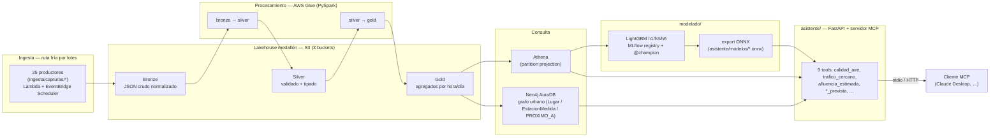

# Madroño — plataforma de datos de movilidad y vida urbana de Madrid

Trabajo de Fin de Máster. Ingesta continua de fuentes públicas de Madrid →
*lakehouse* medallón en S3 (Bronze/Silver/Gold) → modelos predictivos
(LightGBM multi-horizonte, STGNN) → **asistente conversacional** que expone
los datos y las previsiones como herramientas [MCP](https://modelcontextprotocol.io).
Responde preguntas del tipo *«¿cómo estará el tráfico cerca del Retiro dentro
de 3 horas?»* cruzando la capa Gold con un grafo urbano en Neo4j.

Diseño y decisiones completas: `documents/Memoria_TFM FV.docx` (apartados 5.2
y 6.7). Historial de trabajo: `doc/` (una entrada por tarea), `PLAN.md`,
`tasks/`.

## Arquitectura (lo que está construido)



**Fuera de alcance / línea futura (§7.5 de la memoria), NO construido:** la
ruta caliente de streaming (Kafka autogestionado en EC2 —diseñado en
`infra/terraform/kafka.tf` + `infra/kafka/`, sin aplicar—, Flink), tablas
Delta/Iceberg, cuadros de mando Power BI, servido del STGNN (sigue sin export
ONNX), auth/rate-limiting del MCP.

## Estado actual

**Ingesta CONGELADA** desde 2026-08-30 (`pipeline_enabled = false`): los
schedulers de Lambda y los triggers de Glue están DISABLED para no seguir
gastando. La infraestructura, las tablas y los datos ya ingeridos (hasta
~2026-08-29) siguen consultables en Athena y Neo4j, y los modelos
`@champion` + sus ONNX vendorizados en `asistente/modelos/` siguen sirviendo.
El trabajo restante (asistente / MCP) no necesita la ingesta encendida.

Reanudar, backfill de los huecos, accesos y runbook completo:
[`infra/OPERACION.md`](infra/OPERACION.md).

## Ejecutar el asistente en local

Requiere Python 3.12 y credenciales AWS (perfil `madrono`, ver
`infra/OPERACION.md`) para las tools que leen Gold vía Athena, y las
variables `NEO4J_*` para las que cruzan el grafo.

```bash
python -m venv .venv && source .venv/bin/activate   # Windows: .venv\Scripts\activate
pip install -r asistente/requirements.txt

# Credenciales de Neo4j (SSM SecureString, eu-west-1):
export NEO4J_URI=$(aws ssm get-parameter --name /madrono-tfm/dev/secrets/neo4j-uri      --with-decryption --query Parameter.Value --output text)
export NEO4J_USERNAME=$(aws ssm get-parameter --name /madrono-tfm/dev/secrets/neo4j-username --with-decryption --query Parameter.Value --output text)
export NEO4J_PASSWORD=$(aws ssm get-parameter --name /madrono-tfm/dev/secrets/neo4j-password --with-decryption --query Parameter.Value --output text)

# a) API HTTP (para probar las tools con curl / navegador):
AWS_PROFILE=madrono AWS_DEFAULT_REGION=eu-west-1 uvicorn asistente.main:app
#   -> http://127.0.0.1:8000/docs
#   -> http://127.0.0.1:8000/trafico-prevista?lugar=Retiro&horizonte_horas=3

# b) Servidor MCP en stdio (para un cliente MCP real):
AWS_PROFILE=madrono AWS_DEFAULT_REGION=eu-west-1 python -m asistente.mcp_agent.server
```

`mcpServers` de ejemplo para Claude Desktop (`claude_desktop_config.json`):

```json
{
  "mcpServers": {
    "madrono": {
      "command": "python",
      "args": ["-m", "asistente.mcp_agent.server"],
      "cwd": "/ruta/al/repo/madrono",
      "env": {
        "AWS_DEFAULT_REGION": "eu-west-1",
        "NEO4J_URI": "neo4j+s://xxxx.databases.neo4j.io",
        "NEO4J_USERNAME": "neo4j",
        "NEO4J_PASSWORD": "..."
      }
    }
  }
}
```

Sin credenciales, `initialize` + `list_tools` funcionan igual (descubrimiento)
y cada `call_tool` degrada con un `motivo` legible en vez de fallar. Detalle
del contrato de respuesta y de las tools: [`asistente/README.md`](asistente/README.md).

## Ejecutar la evaluación de ML

Cuadernos de evaluación, métricas, comparación de modelos y explicabilidad:
[`modelado/README.md`](modelado/README.md). Auditoría de reproducibilidad
desde un clon limpio: `doc/VIKT-08-reproducibilidad.md`.

## Tests

```bash
python -m pytest ingesta/ procesamiento/ grafo/ asistente/ herramientas/ modelado/ tests/
```

Todo mockea AWS / Neo4j / Spark — no necesita credenciales. Incluye el test
de integración end-to-end (`tests/integracion/`, `doc/FIL-18-...md`).

## Layout del repositorio

| Directorio | Qué hay |
|---|---|
| `ingesta/` | 25 productores (`capturas/`) que normalizan cada fuente pública → Bronze. Lógica en Python puro; el envoltorio Lambda en `bronze.py`. |
| `procesamiento/` | Transformaciones Bronze→Silver→Gold. `silver_gold/<ds>/{transform,aggregate}.py` (Python puro, testeable) + `glue_*.py` (envoltorio PySpark del job de Glue). |
| `infra/` | Terraform del lakehouse, Glue, Lambda, Athena, IAM, observabilidad. `OPERACION.md` = runbook. `kafka/` = diseño de la ruta caliente (sin aplicar). |
| `grafo/` | Construcción del grafo urbano en Neo4j (`:Lugar`, `:EstacionMedida`, `PROXIMO_A`) desde Gold + OSM. |
| `modelado/` | Feature store, entrenamiento LightGBM/STGNN, evaluación, MLflow registry, export a ONNX. |
| `asistente/` | App FastAPI + servidor MCP. `mcp_agent/tools.py` = las 9 tools; `routers/` = espejo HTTP; `modelos/*.onnx` = modelos vendorizados. |
| `herramientas/` | Scripts de operación: `costes/` (estimación de gasto), `salud/` (frescura de Gold, FIL_16). |
| `tests/` | Test de integración end-to-end (el resto de tests vive junto a su paquete). |
| `doc/` | Una entrada por tarea (decisiones, verificaciones). `tasks/` = cola de trabajo. |
