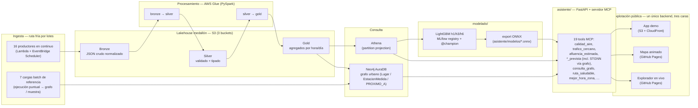

# Madroño — plataforma de datos de movilidad y vida urbana de Madrid

Trabajo de Fin de Máster. Ingesta continua de fuentes públicas de Madrid →
*lakehouse* medallón en S3 (Bronze/Silver/Gold) → modelos predictivos
(LightGBM multi-horizonte, STGNN) → **asistente conversacional** que expone
los datos y las previsiones como herramientas [MCP](https://modelcontextprotocol.io).
Responde preguntas del tipo *«¿cómo estará el tráfico cerca del Retiro dentro
de 3 horas?»* cruzando la capa Gold con un grafo urbano en Neo4j.

Diseño y decisiones completas: [`documents/Memoria_TFM FV.docx`](documents/Memoria_TFM%20FV.docx)
(el documento de entrega, apartados 5.2 y 6.7).

Otros documentos de seguimiento del proyecto, por si hace falta más
contexto: [`PLAN.md`](PLAN.md) (coordinación del equipo, reparto de
trabajo), [`PROGRESS.md`](PROGRESS.md) (bitácora de sesiones de
ingeniería interactiva), [`NEXT_STEPS.md`](NEXT_STEPS.md) (plan
priorizado hacia el cierre), [`PLATFORM_SCHEMA.md`](PLATFORM_SCHEMA.md)
(inventario de plataformas/arquitectura), [`DATA_SOURCES.md`](DATA_SOURCES.md)
(catálogo de las 24 fuentes). Historial técnico tarea a tarea: `doc/`
(una entrada por tarea), `tasks/` (cola de trabajo, ver
[`tasks/README.md`](tasks/README.md)).

## Arquitectura (lo que está construido)



Las tres superficies de la última fila comparten el mismo backend
conversacional (mismo agente MCP, mismo chat) — el mapa animado y el
explorador, publicados gratis en GitHub Pages, llevan el chat incrustado
directamente en la página, no son solo un enlace a la app de demostración.

**Fuera de alcance / línea futura (§7.5 de la memoria), NO construido:** la
ruta caliente de streaming (Kafka autogestionado en EC2 —diseñado en
`infra/terraform/kafka.tf` + `infra/kafka/`, sin aplicar—, Flink), tablas
Delta/Iceberg, cuadros de mando Power BI. El STGNN sí se sirve en
producción (`calidad_aire_prevista_grafo` / `trafico_prevista_grafo`, ver
la tabla de tools) — lo que falta es su **export a ONNX** (bloqueado por
una limitación de `torch.export` con su bucle temporal, se sirve desde su
registro nativo mientras tanto); rate-limiting del MCP (no auth: el
servidor ya se endureció contra clientes no autorizados, `FIL_73`).

## Estado actual

**Ingesta CONGELADA** desde 2026-08-30 (`pipeline_enabled = false`): los
schedulers de Lambda y los triggers de Glue están DISABLED para no seguir
gastando. La infraestructura, las tablas y los datos ya ingeridos (hasta
~2026-08-29) siguen consultables en Athena y Neo4j, y los modelos
`@champion` + sus ONNX vendorizados en `asistente/modelos/` siguen sirviendo.
El trabajo restante (asistente / MCP) no necesita la ingesta encendida.

Reanudar, backfill de los huecos, accesos y runbook completo:
[`infra/OPERACION.md`](infra/OPERACION.md).

## Ejecutar el asistente en local

Requiere Python 3.14 y credenciales AWS (perfil `madrono`, ver
`infra/OPERACION.md`) para las tools que leen Gold vía Athena, y las
variables `NEO4J_*` para las que cruzan el grafo.

```bash
python -m venv .venv && source .venv/bin/activate   # Windows: .venv\Scripts\activate
pip install -r asistente/requirements.txt

# Credenciales de Neo4j (SSM SecureString, eu-west-1):
export NEO4J_URI=$(aws ssm get-parameter --name /madrono-tfm/dev/secrets/neo4j-uri      --with-decryption --query Parameter.Value --output text)
export NEO4J_USERNAME=$(aws ssm get-parameter --name /madrono-tfm/dev/secrets/neo4j-username --with-decryption --query Parameter.Value --output text)
export NEO4J_PASSWORD=$(aws ssm get-parameter --name /madrono-tfm/dev/secrets/neo4j-password --with-decryption --query Parameter.Value --output text)

# a) API HTTP (para probar las tools con curl / navegador):
AWS_PROFILE=madrono AWS_DEFAULT_REGION=eu-west-1 uvicorn asistente.main:app
#   -> http://127.0.0.1:8000/docs
#   -> http://127.0.0.1:8000/trafico-prevista?lugar=Retiro&horizonte_horas=3

# b) Servidor MCP en stdio (para un cliente MCP real):
AWS_PROFILE=madrono AWS_DEFAULT_REGION=eu-west-1 python -m asistente.mcp_agent.server
```

`mcpServers` de ejemplo para Claude Desktop (`claude_desktop_config.json`):

```json
{
  "mcpServers": {
    "madrono": {
      "command": "python",
      "args": ["-m", "asistente.mcp_agent.server"],
      "cwd": "/ruta/al/repo/madrono",
      "env": {
        "AWS_DEFAULT_REGION": "eu-west-1",
        "NEO4J_URI": "neo4j+s://xxxx.databases.neo4j.io",
        "NEO4J_USERNAME": "neo4j",
        "NEO4J_PASSWORD": "..."
      }
    }
  }
}
```

Sin credenciales, `initialize` + `list_tools` funcionan igual (descubrimiento)
y cada `call_tool` degrada con un `motivo` legible en vez de fallar. Detalle
del contrato de respuesta y de las tools: [`asistente/README.md`](asistente/README.md).

<!-- TOOLS:INI (generado por `python -m asistente.gen_tabla_tools`; no editar a mano) -->
**19 tools**, todas con lógica real (ninguna con `NotImplementedError`). Generado desde `asistente/mcp_agent/server.py::TOOLS`.

| tool | endpoint HTTP | qué hace |
|---|---|---|
| `afluencia_estimada` | `GET /afluencia-estimada` | Afluencia estimada ahora |
| `afluencia_prevista` | `GET /afluencia-prevista` | Afluencia prevista |
| `calidad_aire` | `GET /calidad-aire` | Calidad del aire ahora |
| `calidad_aire_prevista` | `GET /calidad-aire-prevista` | Calidad del aire prevista |
| `calidad_aire_prevista_grafo` | `GET /calidad-aire-prevista-grafo` | Calidad del aire prevista (modelo de grafo) |
| `calidad_aire_episodio` | `GET /calidad-aire-episodio` | Probabilidad de episodio de contaminación |
| `calidad_aire_cams` | `GET /calidad-aire-cams` | Calidad del aire previsión Copernicus CAMS |
| `meteo_cercana` | `GET /meteo-cercana` | Meteorología observada cerca de un lugar |
| `avisos_meteo` | `GET /avisos-meteo` | Avisos meteorológicos AEMET |
| `trafico_cercano` | `GET /trafico-cercano` | Tráfico cerca de un lugar |
| `trafico_prevista` | `GET /trafico-prevista` | Tráfico previsto |
| `trafico_prevista_grafo` | `GET /trafico-prevista-grafo` | Tráfico previsto (modelo de grafo) |
| `opciones_movilidad` | `GET /opciones-movilidad` | Opciones de movilidad entre dos puntos |
| `disponibilidad_aparcamiento` | `GET /disponibilidad-aparcamiento` | Disponibilidad de aparcamiento |
| `eventos_cercanos` | `GET /eventos-cercanos` | Eventos cercanos |
| `ruta_saludable` | `GET /ruta-saludable` | Ruta saludable entre dos lugares |
| `contexto_urbano` | `GET /contexto-urbano` | Contexto urbano multi-salto de un lugar |
| `consulta_grafo` | `GET /consulta-grafo` | Consulta parametrizada del grafo urbano (Neo4j) |
| `mejor_hora_zona` | `GET /mejor-hora-zona` | Mejor hora del día para una zona |
<!-- TOOLS:FIN -->

_(La tabla de arriba se regenera con `python -m asistente.gen_tabla_tools`; CI la comprueba.)_

## Demo end-to-end

[`notebooks/demo_madrono.ipynb`](notebooks/demo_madrono.ipynb) recorre el
sistema completo (XML → Gold → grafo → **STGNN con importancia de aristas** →
asistente MCP) en ~4 min y **corre sin credenciales** (mini-grafo sintético +
mocks). Con `AWS_PROFILE`/`NEO4J_*` reales usa datos vivos. Versión de
comandos con datos completos: `doc/VIKT-06-recorrido-e2e.md`.

## Explotación en producción: un backend, tres superficies

El mismo backend conversacional (agente MCP + chat vía Groq) es accesible
desde tres sitios; los dos primeros son el enlace recomendado para
evaluar el proyecto — gratuitos, sin autenticación, con el chat ya
incrustado en la propia página:

- **Mapa animado — https://madrono-ucm.github.io/madronoTFM/** — recorrido
  guiado de 6 capítulos con chat incrustado (`FIL_69`, `FIL_95`: cada
  respuesta muestra qué herramientas MCP se invocaron, y un catálogo de
  preguntas sugeridas ayuda a empezar). El grafo de 1.798 nodos de tráfico
  se recorre hora a hora con la previsión de los STGNN (`trafico` +
  `calidad_aire`), importancia de aristas, índice de salud por nodo, pulso
  de distrito, toggle modelo-vs-persistencia y rutas saludables
  (`ruta_saludable`, `FIL_37`). Se genera **offline** desde los ONNX
  vendorizados y un snapshot congelado de Gold (`viz/data/gold_slices/`);
  detalle en [`viz/README.md`](viz/README.md).
- **Explorador del grafo en vivo — el capítulo 6 del mapa enlaza a él**
  (`https://35-42-164-183.nip.io/grafo/explorador`) — a diferencia del
  mapa, consulta Neo4j real en directo y en solo lectura (~9 800 nodos),
  con su propio chat incrustado (`FIL_67`/`FIL_68`; usuario/contraseña de
  demo `demo`/`demo` si el explorador lo pide).
- **App de demostración — https://d2obcdu8duk47f.cloudfront.net** (`demo`/
  `demo`) — landing + el mismo chat, pensada como puerta de entrada
  alternativa con autenticación básica. Front estático (`web/index.html`)
  en S3 + CloudFront (Origin Access Control, bucket privado); backend
  FastAPI (`asistente/`) en la misma EC2 que el daemon de ingesta, detrás
  de nginx con TLS (Let's Encrypt): `https://35-42-164-183.nip.io`.

Detalle de la infraestructura y bugs encontrados en el despliegue:
`doc/FIL-63-app-web-m1-desplegada.md`, `doc/FIL-62-app-web-m2-chat-groq.md`.

```bash
pip install -r viz/requirements.txt && python -m http.server -d viz/mapa
```

Publicado desde la rama `gh-pages` (`FIL_42`); `viz/mapa/` en `main` es la
fuente de verdad. Figura sin red para la memoria: `viz/mapa_frames.png`.
Limitaciones (§7.4) y seguimiento: [`viz/README.md`](viz/README.md),
`viz/PROGRESO_MAPA.md`.

## Ejecutar la evaluación de ML

Cuadernos de evaluación, métricas, comparación de modelos y explicabilidad:
[`modelado/README.md`](modelado/README.md). Auditoría de reproducibilidad
desde un clon limpio: `doc/VIKT-08-reproducibilidad.md`.

## Tests

```bash
python -m pytest ingesta/ procesamiento/ grafo/ asistente/ herramientas/ modelado/ tests/
```

Todo mockea AWS / Neo4j / Spark — no necesita credenciales. Incluye el test
de integración end-to-end (`tests/integracion/`, `doc/FIL-18-...md`).

## Layout del repositorio

| Directorio | Qué hay |
|---|---|
| `ingesta/` | Captura de fuentes públicas → Bronze. **16 productores en continuo** (Lambda + EventBridge Scheduler, `infra/terraform/lambda.tf::local.producers`) + **7 cargas batch de referencia** (ejecución puntual, alimentan el grafo o dejan una muestra commiteada) + 1 módulo retirado (`afluencia_lugares_madrid`, `FIL_06`). Lógica en Python puro; envoltorio Lambda en `bronze.py`, lectura de secretos en `secretos.py`. |
| `procesamiento/` | Transformaciones Bronze→Silver→Gold. `silver_gold/<ds>/{transform,aggregate}.py` (Python puro, testeable) + `glue_*.py` (envoltorio PySpark del job de Glue). |
| `infra/` | Terraform del lakehouse, Glue, Lambda, Athena, IAM, observabilidad. `OPERACION.md` = runbook. `kafka/` = diseño de la ruta caliente (sin aplicar). |
| `grafo/` | Construcción del grafo urbano en Neo4j (`:Lugar`, `:EstacionMedida`, `PROXIMO_A`) desde Gold + OSM. |
| `modelado/` | Feature store, entrenamiento LightGBM/STGNN, evaluación, MLflow registry, export a ONNX. |
| `asistente/` | App FastAPI + servidor MCP. `mcp_agent/server.py::TOOLS` = registro único de las tools (incl. `calidad_aire_prevista_grafo` / `trafico_prevista_grafo` STGNN de grafo `FIL_26`/`FIL_31`, `ruta_saludable` `FIL_37`, `contexto_urbano` `FIL_53`, `mejor_hora_zona` `FIL_46`); `routers/` = espejo HTTP; `modelos/*.onnx` = modelos vendorizados. Tabla y conteo: `python -m asistente.gen_tabla_tools`. |
| `herramientas/` | Scripts de operación: `costes/` (estimación de gasto), `salud/` (frescura de Gold, FIL_16). |
| `viz/` | Mapa animado del grafo (`FIL_32`–`FIL_36`): scripts de build offline, `mapa/` (HTML deck.gl + JSON), `data/gold_slices/` (snapshot Gold congelado), `PROGRESO_MAPA.md`. |
| `web/` | App de demostración (landing + chat, `FIL_62`/`FIL_63`): `index.html` estático, sin dependencias, desplegado en S3 + CloudFront. |
| `documents/` | `Memoria_TFM FV.docx` (el documento de entrega) y `figuras/` (fuentes Mermaid + renderer de las figuras embebidas en la memoria, `python -m documents.figuras.mermaid_render`). |
| `tests/` | Test de integración end-to-end (el resto de tests vive junto a su paquete). |
| `doc/` | Una entrada por tarea (decisiones, verificaciones). `tasks/` = cola de trabajo. |
