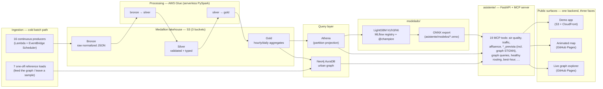

# Madroño — Technical Defense Companion

**Purpose of this document.** This is not a description of the thesis — it is
preparation material *for you*, to defend it. Every section pairs **what was
built** with **why it was built that way**, the alternatives that were
considered and rejected, and the honest limitations. Numbers are real,
pulled from the repository's own artifacts (test suites, evaluation CSVs,
platform inventories), not from the narrative prose of the memoria. Where a
number is a point-in-time snapshot (AWS spend, Neo4j node counts), the date
is given — treat it as "true as of that date," not as a live figure.

Project: **Madroño**, a TFM (Master's thesis) building an end-to-end urban
mobility data platform for Madrid — from open-data ingestion to a
conversational assistant that reasons over live and predicted city
conditions. Two-person team: Filippos Dorezi (**Sistema** track — code,
infrastructure, ML) and Víctor Huaman (**Memoria** track — the thesis
document), with shared sections.

---

## 1. The one-paragraph pitch

Madroño ingests ~15 public Madrid data feeds (traffic, air quality, noise,
weather, bikes, parking, events…) into a medallion lakehouse on S3
(Bronze→Silver→Gold), models the city as a **graph** in Neo4j (places,
sensors, transit stops, and their spatial/topological relationships), trains
two tiers of forecasting models (LightGBM per-sensor, and a **custom
graph neural network** with a temporal component for city-wide,
explainable forecasts), and exposes all of it through a **conversational
assistant** built on the **Model Context Protocol (MCP)** — the same
protocol Claude Desktop and other LLM clients use to call tools. The
system's "wow" deliverable is a public, hosted, hour-by-hour **animated map**
of Madrid's traffic graph driven by live model output, with an embedded
chat, published for free on GitHub Pages. Everything was engineered under a
hard constraint: **near-zero AWS cost**, which explains almost every
infrastructure decision from Lambda-over-EC2 to Glue-over-EMR to
Neo4j-Aura-Free-over-self-hosted.

---

## 2. Why this system exists (motivation → design chain)

The thesis brief (§3.2 of the memoria) asks for: model the city as a graph,
train predictive models for congestion/affluence/air quality, and expose
insight through an assistant. Every architectural choice downstream traces
back to three constraints that are worth stating explicitly, because a
defense question that starts "why didn't you just use X" almost always
resolves to one of these:

1. **Two people, no ops budget.** There is no dedicated infra/SRE role.
   Anything that needs to be "kept running" (a Kafka broker, a Spark
   cluster, a self-hosted graph DB) is a liability the team cannot absorb.
   This is why the entire pipeline is serverless (Lambda, Glue, Athena) and
   why Neo4j is the free AuraDB tier, not a self-managed instance.
2. **A hard deadline (2026-09-17) and a short real data window.** Continuous
   ingestion only started 2026-08-14. By the time models were trained there
   were ~3–4 weeks of hourly history. This is *the* single fact that
   explains why the ML section is framed as "a methodology demonstration,
   not a performance estimate" — there is structurally not enough data for
   seasonal patterns, and the thesis says so explicitly rather than
   overclaiming.
3. **Data must be free and legally reusable.** All sources are open data
   (Ayuntamiento de Madrid, AEMET, Copernicus CAMS, Bluesky) under
   attribution-only licenses. The one source that would have required a
   paid/credentialed tier with a billing account attached (Google Maps
   Places / `populartimes`, for the "affluence" signal) was **investigated,
   verified as infeasible at $0, and replaced** — this is a good example to
   cite in defense of "engineering judgment under constraint," not a gap.

**A frequently useful defense framing**: almost nothing in this project was
built because it was the "best" technology in the abstract — it was built
because it was the best technology *given the two constraints above*. Being
able to say, for any component, "here is the alternative, and here is the
specific cost/ops/time reason we didn't take it" is the strongest possible
defense posture, and the sections below are written to give you exactly
that for each layer.

---

## 3. High-level architecture

**What's deliberately *not* built (§7.5 of the memoria — future work, not an
oversight):** a hot streaming path (Kafka + Flink), Delta/Iceberg tables,
Power BI dashboards. Each has a one-line reason (see §9 "Explicitly rejected
alternatives" below) and each was *designed* in code even when not applied
(e.g. `infra/terraform/kafka.tf` exists, written and reviewed, but was never
`terraform apply`'d — a deliberate scope decision, not an unfinished task).

### 3.1 The repository, by layer

| Directory | Role | Analogy for the defense |
|---|---|---|
| `ingesta/` | Source capture → Bronze | "The sensors" |
| `procesamiento/` | Bronze→Silver→Gold ETL | "The refinery" |
| `infra/` | Terraform for everything above | "The plant" |
| `grafo/` | Gold/Bronze → Neo4j graph ETL | "The city model" |
| `modelado/` | Feature store, training, MLflow, ONNX export | "The forecasters" |
| `asistente/` | FastAPI + MCP server (19 tools) | "The interface" |
| `viz/` | Offline-built animated map | "The showcase" |
| `web/` | Static demo landing + chat | "The front door" |
| `herramientas/` | Cost estimation, Gold-freshness checks | "Ops scripts" |
| `documents/` | The thesis document + Mermaid figure sources | — |
| `tasks/` / `doc/` | The autonomous-agent task queue + per-task decision log | "The engineering journal" (see §4) |

---

## 4. Development methodology: an autonomous coding agent as the "third team member"

This is worth defending on its own, independent of the system it produced,
because it is itself an engineering decision under the "two people, no
budget" constraint (see the thesis's own §4.2, added specifically to frame
this).

**The setup**: `tasks/` is a strict-order work queue for `madrono-agent`, a
daemon running 24/7 on an EC2 instance. Each `tasks/NNN-slug.md` file is a
prompt (what to implement, acceptance criteria, constraints). The daemon:

1. Picks the lowest-numbered `pending` task.
2. Runs Claude Code with **full permissions, no human in the loop during
   execution** (`--permission-mode bypassPermissions`).
3. Opens a PR.
4. **Stops the entire queue** if the task fails hard — it does not skip
   ahead to task N+1.
5. Does **not** start task N+1 until task N's PR is **merged** — by a human,
   by default.

**Why this design, specifically:**

- **The only real safety net is the PR gate.** Because the agent runs
  unsupervised with full tool access, the single non-negotiable invariant is
  "nothing reaches `main` without a human reading the diff." Everything else
  (task ordering, retry/backoff, `doc/` logging) is scaffolding around that
  one invariant.
- **`allow_infra_apply: true` is the one deliberate escape hatch** — a task
  can be explicitly authorized to run real `terraform apply`/`aws` mutating
  commands, but this bypasses the PR-review safety net (the AWS state
  changes *before* any PR exists to review). The documented mitigation is
  procedural, not technical: split "plan" and "apply" into two separate
  tasks, so a human reviews the plan before the follow-up task applies it.
  This is a real design trade-off you should be ready to defend: it's an
  acknowledged weak point, mitigated by process rather than by a stronger
  technical guarantee, because building the stronger guarantee (e.g. a
  human-approval gate baked into the agent loop) was out of scope for a
  two-person team on a deadline.
- **`force: true` (auto-merge) exists but is used sparingly** — it trades
  the human-review safety net for throughput, and is reserved for
  low-risk/no-dependents tasks (scaffolding, isolated fixes). A real gap was
  found and fixed mid-project: `force: true` originally could merge a PR
  with **failing CI** because `merge_pr()` didn't wait for checks and `main`
  had no branch protection (`doc/101`) — both were fixed once discovered.
  This is a good concrete example of the system catching and correcting its
  own process gap, worth citing if asked "how do you know the process is
  sound."
- **Numeric ordering is the only dependency mechanism.** There's no DAG, no
  task graph — task N+1 can assume everything in tasks 1..N is done. This is
  a simplicity-over-flexibility trade: it's easy to reason about ("what
  exists at task 067?") but means re-ordering work requires renumbering, and
  a stuck task blocks *everything* behind it (which happened at least once
  — see the Neo4j `SessionExpired` incident in §6).
- **`doc/NNN-slug.md`** — one entry per completed task, containing the
  actual decisions and verifications made — is the running engineering
  journal this defense document draws from. It is generated *by the same
  agent that did the work*, as part of the task, not written after the fact
  by a human summarizing — which is why it contains negative/failed findings
  (e.g. "this data source has 1 row, here's proof, here's why") rather than
  just success stories.

**How this shows up in the final product**: nearly every README in this repo
follows the same pattern — a design decision, followed immediately by "why
not X," followed by "verified against real data: \<concrete number\>." That
is not accidental style; it is the artifact of an agent whose task
acceptance criteria explicitly required verification against the real AWS
account rather than mocks, whenever real credentials were available in the
session. It also explains the sheer *volume* of documented edge cases (see
§6, §7) — a two-person team could not have manually verified this many
data-quality corner cases in the available time; the agent's task structure
(one focused task, one PR, one verification write-up) made it tractable.

**A fair, defensible framing if a jury member is skeptical of "an AI wrote
your thesis's code":** the agent is a *tool with a tight leash* — one task
at a time, strict ordering, mandatory human PR review, degraded fallback for
missing credentials, and a documented incident where its own process gap
(auto-merge ignoring CI) was found and closed. The engineering judgment
(what to build, in what order, which trade-offs to accept) is the human's;
the agent is disciplined labor under review, not an autonomous designer.

---

## 5. Data layer

### 5.1 Sources (what, and under what license)

All sources are open data, primarily `datos.madrid.es` (14 municipal
datasets: traffic, air quality, noise, weather, BiciMAD, parking,
districts/neighbourhoods, events, cinema listings, pedestrian/bike counts,
labor calendar, POIs, street network), plus **AEMET OpenData** (weather
forecasts/warnings, requires a free API key), **Copernicus CAMS** (EU-wide
air quality forecast, NetCDF, free key), and **Bluesky/AT Protocol**
(social mentions, no key). See `DATA_SOURCES.md` for the full
attribution/license table. Suggested attribution line: *"Contains data from
Ayuntamiento de Madrid (datos.madrid.es) and AEMET."*

**One source was deliberately rejected after investigation, not just
avoided**: Google Maps Platform's `populartimes` signal (place popularity —
the originally planned input for "affluence") requires a billing account
with a card on file **even within the free tier**. This was verified at the
code/API level (`doc/083-investigacion-google-maps-arquitectura.md`), not
assumed, and the team pivoted to a **graph-derived signal** instead: resolve
a place → nearby sensors via the `PROXIMO_A` graph relationship → combine
real traffic, noise, BiciMAD, and air-quality readings near it. This is a
strong example to cite in defense: a named, budgeted alternative was killed
by verified evidence, and replaced by a design that reuses infrastructure
already built for another purpose (the graph) rather than adding a new
dependency.

### 5.2 Ingestion (`ingesta/`) — one Bronze writer, many producers

**Pattern, shared by every producer**: download → normalize to a small fixed
schema → write via `BronzeWriter` to
`<dataset>/fecha=YYYY-MM-DD/hora=HH/<timestamp>.json`.

Key engineering decisions, each with a concrete "why":

- **Partition in Madrid local time, not UTC.** `BronzeWriter.write_batch`
  defaults to `now_madrid()` (Python stdlib `zoneinfo`, no new dependency)
  so that `fecha=`/`hora=` reflect what a human analyst expects when they
  say "yesterday" — DST-correct without a dependency.
- **Bronze conserves data as-received, errors included.** Traffic sensor
  readings with `error_code != "N"` still land in Bronze with `null`
  fields rather than being silently dropped at capture time — the *decision*
  to discard bad data belongs to the Silver quality gate, not to the
  ingestion layer, so Bronze remains a faithful, replayable copy of what the
  source actually said.
- **Raw coordinate systems are preserved, not reprojected, in Bronze.**
  Madrid's traffic feed publishes UTM ETRS89 zone 30N (EPSG:25830); Bronze
  keeps `x`/`y` as given. Reprojection to WGS84 lat/lon happens in Silver
  (see §5.3) — a layering discipline (Bronze = source-faithful, Silver =
  analysis-ready) that recurs throughout the pipeline.
- **Two producer "shapes" coexist on purpose**: 16 **continuous** producers
  (Lambda + EventBridge Scheduler, cron-like cadence per source) vs. 7
  **one-off reference loads** (district boundaries, POIs, the CRTM transit
  network — data that barely changes, captured once and committed as a
  fixture, never scheduled). Conflating these would have meant scheduling
  infrastructure for data that never needs refreshing — a real cost/ops
  saving, not just tidiness.
- **Two-source joins are common and are handled the same way everywhere**:
  most municipal feeds separate "live reading" from "station metadata"
  (air quality: 24-magnitude JSON + a separate stations CSV; noise: a daily
  CSV + a stations CSV; parking: two SOAP calls). This repeated pattern
  (verified independently per source, not assumed) is why several
  `ingesta/capturas/*.py` modules do two HTTP calls per capture.
- **A real, cited authentication bug**: the EMT MobilityLabs integration
  initially assumed **personal-account** login (email/password, v1 API) and
  was blocked. The actual mechanism is **application-level** credentials
  (`x-ClientId`/`passKey`, v1.1). This was discovered and fixed by directly
  testing against the live API rather than trusting the first reading of
  the docs — a good micro-example of "verify against reality" discipline
  that recurs throughout the project.
- **A structurally limited data source, documented rather than hidden**:
  `transporte_publico_emt` only ever captures **one bus stop** (`stop_id=71`
  by default) because the underlying EMT API is "one stop per call," and no
  producer was ever built to enumerate and sweep all stops. This is called
  out explicitly in `NEXT_STEPS.md` as a known, low-priority gap (not a bug)
  — expanding it is "a new feature, not a fix."

### 5.3 Processing (`procesamiento/`) — the medallion architecture and why Glue

**Bronze → Silver → Gold**, replicated per-dataset under
`procesamiento/silver_gold/<dataset>/`. The core engineering decision, made
once in the pilot dataset (traffic) and then replicated 14 times, deserves
its own explanation because it's the kind of thing an examiner will probe:

**Decision: business logic is pure Python (`transform.py`, `aggregate.py`,
`geo.py`), with zero `pyspark`/`pandas`/`great_expectations` import
dependency. Only the thin `glue_*.py` entry points touch Spark.**

Why this matters, concretely:
- It makes the actual validation rules and aggregation formulas **unit
  testable on a laptop**, with no Spark cluster, no JVM, nothing but the
  Python standard library. In an environment where installing real Spark
  locally was not practical, this was the difference between "tested" and
  "untested."
- It cleanly separates **what** the transformation does (a pure function
  over `dict`/`list`, readable and testable) from **how** it's executed at
  scale (Spark's `mapPartitions` for row-wise Bronze→Silver work, native
  `DataFrame.groupBy().agg()` for Silver→Gold reductions — these genuinely
  need different Spark primitives because one is row-independent and the
  other combines rows across files/partitions). The pure function is the
  **documented source of truth** for the schema; the Spark job is required
  to reproduce it exactly, which is stated explicitly in both modules'
  docstrings as a maintenance invariant.
- It let the team avoid **binary/compiled dependencies** wherever geometry
  math was needed: `geo.py` reimplements UTM↔WGS84 reprojection using
  **closed-form Snyder formulas** (USGS, 1987) in pure Python instead of
  `pyproj` (a compiled binding over PROJ). This wasn't cargo-culting
  minimalism — it was a direct response to a *real* deployment problem hit
  earlier in the project with `netCDF4` (a compiled dependency for the CAMS
  producer), which required a whole extra CodeBuild-based Lambda Layer
  pipeline to compile for the Lambda runtime. Avoiding a second occurrence
  of that friction, for a geometry operation that has a simple closed form
  anyway, was a deliberate lesson-learned decision. Verified with a
  round-trip test (project → invert, error < 1e-8°) rather than assumed.

**Why AWS Glue, specifically, and not EMR or a persistent Spark box**: Glue
is Spark, but billed **per DPU-hour while a job runs**, with zero cluster to
keep warm between runs. Given the pipeline's cadence (hourly/daily, not
continuous stream processing), a persistent cluster would be paying for
idle capacity almost all the time. This is the same cost logic that drove
Lambda-over-EC2 for ingestion — one coherent "serverless-first" principle
applied consistently across the stack, not a per-service ad hoc choice.

**Quality gates are real, not decorative.** Each dataset has:
1. A **plausibility gate** in `transform.py` (`validate_record`) — rejects
   records with impossible values (negative counts, out-of-bounds
   coordinates, sensor self-reported errors). These are **plausibility
   ranges, explicitly documented as non-official** (Madrid's open data
   catalog doesn't publish, e.g., the exact valid range of `nivelServicio`)
   — the thesis is honest about this rather than presenting invented ranges
   as authoritative.
2. A **Great Expectations suite** (`ge_suite.py`) running inside the real
   Glue job — used as **observability, not a hard filter** (a second,
   independent check layered on top of the plausibility gate, reporting to
   `silver/_quality_reports/`, not blocking the pipeline on its own).

**Per-dataset differences are real, not copy-paste noise** — and each is a
small case study in "read the data before assuming the schema":
- `bicimad`: consistency check `bikes_available + bikes_disabled ≤
  docks_total` uses `≤`, not `==`, because bikes rented out (in transit, not
  docked anywhere) systematically make the sum *undercount* capacity — this
  was **verified against the real captured sample** before writing the rule,
  correcting an initial assumption of exact equality.
- `aparcamientos`: sharing live occupancy is *voluntary* per parking lot, so
  `null` values are a legitimate signal of "this lot doesn't share," not
  corrupt data — explicitly **not** discarded, to avoid hiding that the
  dataset's coverage is partial by source design.
- `meteorologia`: Bronze is *wide* (all magnitudes per station in one
  record); Silver pivots to *long* (one row per station+magnitude+hour) to
  match the rest of the pattern — and validation happens at **two
  independent levels** (station/instant, then per-magnitude), so one broken
  temperature sensor doesn't discard a station's valid humidity/wind
  readings in the same record.
- `ruido` (noise): the source is **daily**, not hourly — there is no
  real-time noise feed for Madrid at all. This directly explains why the
  animated map's noise layer (§8) is a daily-per-district constant, not an
  animated hourly signal — a data-layer limitation that propagates visibly
  all the way to the final visualization, and is documented as such (limitation G2).
- `cartelera_cines_estrenos` / `agenda_eventos`: these are **catalogs of
  discrete facts** (a screening, an event), not repeated numeric
  measurements — so neither the quality gate nor the Gold aggregation
  follows the "average per hour" pattern used everywhere else. Recognizing
  this and diverging from the established pattern (rather than forcing a
  numeric-series shape onto categorical event data) is itself a design
  decision worth being able to explain.

**A real production incident worth knowing**: 37 of 48 Glue jobs entered
`LAUNCH ERROR` because the shared library zip (`procesamiento.zip`) was
keyed by content hash in S3, and partial `terraform apply`s left jobs
pointing at already-deleted hash-keyed generations — roughly 28 hours of
broken Bronze→Silver. Fixed by moving to a **stable S3 key**
(`glue-libs/procesamiento.zip`) so a new deploy overwrites in place instead
of orphaning old jobs. This is a good "real infra failure and root cause"
story if a defense question probes reliability.

### 5.4 The cost-driven shutdown

Ingestion has been **frozen** since 2026-08-30 (`pipeline_enabled=false`):
Lambda schedules and Glue triggers are disabled to stop spend, while all
data already ingested (through ~2026-08-29) remains queryable in Athena and
loaded in Neo4j, and the `@champion` models (plus their vendored ONNX
exports) keep serving. This was a **deliberate decision, not an outage** —
the remaining assistant/MCP engineering work does not need live ingestion,
and the team chose to stop paying for it. AWS spend at the point of freezing
was ~$280 (2026-08-30 snapshot) — worth having ready if asked about cost
discipline, since it's a genuinely small number for what was built.

---

## 6. The graph layer (`grafo/` → Neo4j)

### 6.1 Why a graph at all

The thesis brief specifically calls for modeling the city as a graph. Beyond
satisfying that requirement, the graph does concrete engineering work that
would otherwise be duplicated ad hoc in every downstream consumer:

- It is the **single place** where "what senses are near this place"
  (`PROXIMO_A`, generic spatial proximity within 300 m, Haversine) and
  "what administrative area contains this point" (`UBICADO_EN`,
  point-in-polygon against real district/neighbourhood GeoJSON) are computed
  **once**, then reused by every MCP tool that needs "near X" semantics
  (`trafico_cercano`, `afluencia_estimada`, `eventos_cercanos`,
  `opciones_movilidad`, `contexto_urbano`, `ruta_saludable`,
  `mejor_hora_zona` — seven of the nineteen tools).
- It is explicitly the layer chosen to avoid an ad-hoc heuristic elsewhere:
  when the traffic Gold aggregation pilot considered "aggregate by
  district," the team recognized that answering "which district contains
  this point" with a bounding-box hack would duplicate, worse, exactly the
  point-in-polygon relationship the graph task was going to build properly
  — so the pilot deferred to the graph instead of improvising.

### 6.2 Schema and construction pipeline

5 node labels (`Distrito`, `Barrio`, `Lugar`, `EstacionMedida`,
`ParadaTransporte`) and 4 relationship types
(`PERTENECE_A` neighbourhood→district, `UBICADO_EN` point-in-polygon,
`PROXIMO_A` generic spatial proximity, `CONECTADO_CON` real transit
adjacency from CRTM route sequences). Construction is a clean three-stage
pipeline mirroring the rest of the repo's style:

1. `extract.py` — reads Gold via **Athena** for anything that has a Gold
   table (avoids re-implementing partition logic Athena already solves),
   and reads Bronze **directly from S3** for the 3 reference-only sources
   (districts, POIs, CRTM transit network) that never had a Silver/Gold
   pipeline built for them.
2. `nodos.py` / `relaciones.py` — pure Python transforms from raw records to
   node/relationship dicts, fully unit-testable with no `neo4j` driver
   installed.
3. `cypher.py` / `cargar_grafo.py` — translates those dicts to parameterized
   `MERGE` statements and loads them; the only place the `neo4j` driver is
   imported, and even then **lazily** (inside `__init__`, not at module
   import time), so the rest of the package stays importable without the
   dependency installed.

**Geometry is pure Python here too** (`geo.py`: ray-casting
point-in-polygon, Haversine distance) — same rationale as §5.3: avoid
`shapely`/compiled geometry dependencies for operations that have a simple,
testable closed form.

**A documented, unresolved performance trade-off worth being ready to
discuss**: `PROXIMO_A` computation is **O(n²)** over all located nodes — a
few tens of millions of comparisons at current volumes (~5,400 nodes with
location), acceptable in Python today but explicitly flagged as "the first
thing to optimize with a spatial index (e.g. a ~300 m grid) if node volume
grows a lot." This is a real, acknowledged scalability limit, not
something the thesis hides — a good answer to "does this scale?"

### 6.3 Data-quality findings surfaced while building the graph

The graph-loading task is where several real data gaps were **discovered
and documented rather than silently worked around** — a strong pattern to
cite if asked "how do you know your data is trustworthy":

- `transporte_publico_emt` Gold has **exactly one distinct `stop_id`**
  across every date partition — confirmed with a direct `COUNT(DISTINCT
  stop_id) GROUP BY date` query, not assumed. Root-caused (§5.2) to the
  producer's one-stop-per-call design, not a loading bug.
- `aparcamientos` Gold was **completely empty** at graph-build time (later
  fixed, see §5.3's incident). The extraction function was written to
  return `[]` cleanly, not to error, in this case.
- The three Bronze-only reference sources (districts, POIs, CRTM) had
  **never actually been uploaded to the real Bronze bucket** — their
  ingestion scripts write to local disk only, by design (one-off reference
  loads, see §5.2), so `extract.py`'s S3 prefix names are a **documented
  convention**, not something verified against a real object, because no
  real object exists yet at those prefixes.

### 6.4 A real operational incident: unindexed Neo4j reload

A full graph reload against the already-populated AuraDB instance **hung
for 3 hours** before being killed and diagnosed: the `schema.cypher`
`UNIQUE` constraints that the `MERGE` statements depend on for efficient
lookups had **never actually been applied** to the real instance, despite
the schema doc already warning that they were required. Applying the schema
constraints first is now stated as a "real prerequisite, not just
documentation" before any full reload. (A second, related incident —
`SessionExpired` on AuraDB Free during long reloads — was fixed by
rewriting the load loop to batch with `UNWIND` and add reconnect/retry
logic, bringing a full reload down to ~9 minutes.) Both are good concrete
"we hit a wall, diagnosed it, and fixed the root cause" stories.

### 6.5 Graph analytics as a standalone contribution

Beyond serving the assistant, the graph was analyzed offline with
`networkx` (not live Neo4j GDS, which is session-based/serverless-billed on
AuraDB — see §6.6) for genuine structural insight into the transit network's
resilience:

- **683 articulation points**, **740 bridges** (20.3% of all edges) — a
  transit network with very little redundancy at the topology-as-modeled
  level.
- **k-core** analysis: max core number 2, only 76% of nodes even reach the
  2-core.
- **Robustness curve**: removing the **top 5% highest-degree nodes**
  collapses the largest connected component to **~39.6%** of its original
  size, versus **~89.1%** remaining under equivalent **random** node
  removal — the network is structurally much more vulnerable to targeted
  disruption than to random failure, a textbook signature of a
  hub-dependent network.

**Important caveat to state proactively in defense, because it changes what
this result means**: `CONECTADO_CON` models **one representative trip per
transit line** (the first `direction_id="0"` sequence from the source GTFS
data), not the full operated network with branches and parallel services.
The resulting graph is therefore intrinsically under-connected compared to
the real EMT/Metro network. The finding is valid as a statement about *the
graph as modeled*, and is useful for reasoning about the model's own
behavior — it is explicitly **not** presented as an operational diagnosis of
the real transit system. Stating this caveat unprompted, rather than
waiting for a jury member to catch it, is the stronger defense posture.

### 6.6 Neo4j: why AuraDB Free, and its real limits

- **AuraDB Free** was chosen for the same zero-cost-infrastructure reason as
  everything else. It comes with **APOC 2026.08.0 fully available
  in-DBMS**, including `apoc.algo.dijkstra` — verified live, which unblocked
  a planned Cypher-native shortest-path feature (`FIL_54`).
- **Graph Data Science ("Aura Graph Analytics") is registered but
  session-based**: calling `gds.graph.project` asks for a `sessionId` /
  `gds.session.getOrCreate(...)` — it provisions an ephemeral **cloud
  resource with a possible cost**, not an in-DBMS batch operation. This is
  why the resilience analysis above runs **offline against an exported
  snapshot** (`grafo/exportar_grafo.py` → `grafo_urbano.json.gz` +
  `networkx`) instead of live GDS — a direct consequence of the zero-cost
  constraint, not an oversight.
- The live database's actual name is **not** `"neo4j"` (the client
  library's default) but the URI subdomain itself (an AuraDB quirk) — a
  small but real gotcha documented so it isn't rediscovered.

---

## 7. Machine learning layer (`modelado/`)

This is explicitly the thesis's centerpiece (§3.2's own framing: "model the
city as a graph and train predictive models"). The engineering here is the
most defensible part of the project *because* it is the most honest about
its own limits — be ready to lead with that honesty rather than have it
extracted by questioning.

### 7.1 The one fact that governs every ML decision: the data window

Continuous ingestion started **2026-08-14**. By training time there were
**~3–4 weeks of hourly history** — roughly 550+ hourly snapshots. This
structurally rules out:
- Any claim of seasonal or long-range temporal pattern learning.
- A performance estimate that generalizes beyond "this specific August."

What it **does** support, and what the thesis restricts itself to claiming:
- Short-horizon forecasting (1h/3h/6h) from recent lags + calendar + weather
  + graph neighbors.
- A **temporal holdout** (last 3 days) comparison against real baselines.
- The model-family comparison (persistence vs. LightGBM vs. GNN) and
  explainability studies (SHAP, edge importance) that §7.3 of the memoria
  presents — these are valid regardless of window length, since they
  compare methods against each other on the same data, not against an
  external ground truth of "true seasonal performance."

Two planned ablation studies (multi-signal fusion vs. single-source; "common
European substrate only") were **explicitly descoped**, not silently
dropped — documented as a scoping decision made under time pressure
(`VIC_05`), with the reasoning on record. If asked "why isn't ablation X in
the thesis," the honest answer is "we made a scoping call under a 2.5-week
runway, and documented why," which is a defensible answer; pretending it
was never considered would not be.

### 7.2 Feature engineering: the anti-leakage discipline

**Golden rule, applied uniformly**: every feature carries a `known_at`
timestamp, and only features with `known_at ≤ t` may enter the panel row for
hour `t`.

- **Lags/rolling stats of the target** → `shift(+k)` (only past values).
- **The label itself** (target at horizon `h`) → `shift(-h)` (future, by
  construction — this is what's being predicted, not a feature).
- **Calendar** (hour, weekday, holiday) → always known.
- **Observed weather at `t`** → known at `t`.
- **AEMET forecast** → an exogenous *future-known* feature: it's yesterday's
  forecast for today, deliberately using the forecast **as it would have
  been available at prediction time**, not a same-day forecast that
  wouldn't exist yet operationally.
- **Graph neighbors' series** → same `known_at` discipline applied
  recursively to each neighbor's own lags.

This is the single most important thing to be able to explain clearly in
defense: it is the standard, correct way to build features for time-series
ML without leaking the answer into the inputs, and the fact that it's
applied as an explicit, named, uniformly-enforced rule (rather than
"we were careful") is worth stating plainly.

**19-feature contract** (documented in `modelado/export/CONTRATO.md`,
enforced by the ONNX export test): raw value, lat/lon, 4 lags (1h/2h/3h/24h),
4 rolling stats (3h/24h mean+std), 4 calendar fields (hour, weekday,
weekend, holiday), and 4 cyclical encodings (`sin`/`cos` of hour and
weekday) — the cyclical encodings exist so the model sees hour 23 and hour 0
as adjacent, not maximally distant, which a raw integer 0–23 would not
convey.

### 7.3 Tier 1 — LightGBM, multi-horizon, per-sensor

Standard gradient-boosted trees, one model per `(target, horizon)` pair
(`calidad_aire`/`trafico` × h1/h3/h6), trained via
`modelado.training.train_gbt`, logged to **MLflow** (SQLite-backed local
registry, `@champion` tag per target/horizon).

**Honest result — this is the section to lead with in defense, because it
demonstrates rigor, not weakness**: on the real production-window panels
(`modelado/evaluation/artifacts/estudios/comparacion_todos.csv`), skill
versus a **persistence baseline** (predict "same as now") is mixed for
`calidad_aire`:

| Target | Horizon | Baseline MAE | LightGBM MAE | Skill vs. baseline |
|---|---|---|---|---|
| calidad_aire | h1 | 3.39 | 3.55 | **−0.16** (worse) |
| calidad_aire | h3 | 6.11 | 6.05 | **−0.13** (worse) |
| calidad_aire | h6 | 6.96 | 5.59 | **+0.24** (better) |
| trafico | h1 | 0.096 | 0.076 | **+0.34** |
| trafico | h3 | 0.139 | 0.088 | **+0.58** |
| trafico | h6 | 0.193 | 0.092 | **+0.75** |

**Why this is a good result to present, not a weakness to hide**: air
quality at 1–3h out is dominated by strong autocorrelation with the current
reading over such a short, calm data window — persistence is a genuinely
hard baseline to beat there, and a model that quietly loses to it is more
useful to know about than one that isn't checked. Traffic, by contrast, has
real intraday dynamics (rush hour transitions) that persistence cannot
capture, and LightGBM wins clearly and by a growing margin at longer
horizons — exactly the pattern you'd expect if the model is learning real
structure rather than overfitting. Being able to explain *why* one target
beats baseline and the other doesn't (rather than only reporting the
numbers) is what separates "ran an experiment" from "understood the
result."

**Explainability**: SHAP importance per horizon (`modelado.evaluation`)
shows the expected pattern — at h1, the current `value` dominates; by h6,
the 24h rolling mean and prior-day lag dominate, weather forecast features
(`prev_temp_max_c`, `prev_wind_kmh`) start appearing — a sanity-check that
the model is leaning on progressively longer-range signal as the horizon
grows, which is the behavior you'd want and expect from a well-fit model on
this kind of data.

### 7.4 Tier 2 — the STGNN ("the wow" of the ML section)

**Architecture** (`modelado/models/stgnn.py`, ~100 lines, plain `torch`, CPU
only): **GraphSAGE + GRU**.

1. For each hour in the input window, run `capas_gnn` (default 2) message-passing steps over the urban graph → a per-node embedding.
2. A GRU consumes the sequence of per-node embeddings over the window → a final per-node state.
3. A linear head projects to `[n_nodes, n_horizons, n_targets]`.

**The one design decision worth explaining in detail, because it's the most
"engineering-judgment" part of the whole ML section**: the graph
convolution (`ConvGraphSAGE`) is **implemented by hand** — a weighted
neighbor mean via `index_add`, plus a linear self-term — instead of using
`torch_geometric`. The stated reason is not "reinventing the wheel for its
own sake": doing it by hand keeps `edge_weight` **inside the autograd
graph**, so `∂loss/∂edge_weight` is directly computable and *is* the edge
importance metric the whole "graph explainability" story depends on. Using
a library's optimized (and often autograd-opaque for edge weights)
convolution would have made this specific, ticket-required deliverable
(interpretable edge importance) harder to get cleanly. The trade-off
accepted: a hand-rolled layer is less optimized and less battle-tested than
a library implementation — acceptable because the model is explicitly a
small, regularized methodology demonstration (§7.4 of the memoria says so
directly), not a SOTA claim, and the only hard dependency needed stays
`torch` (CPU-only wheel, ~760 MB — the `requirements.txt` explicitly points
at PyTorch's CPU wheel index to avoid pulling ~4.5 GB of unusable CUDA/NVIDIA
packages that would fail to import without a GPU toolkit anyway).

**Honest result, on the production window**: the STGNN was **not** run
through the same short-window comparison table as LightGBM in the final
snapshot shown above (Tier 2 rows were trained separately, see
`tier2_*.csv`), but the memoria's own framing (repeated consistently
throughout the repo's docs) is unambiguous and worth repeating verbatim in
defense: **the graph STGNNs lose to the per-sensor LightGBM models on raw
point-forecast accuracy** on this short window. They are served in
production anyway — for graph explainability (`vecinos_influyentes`, the
edges with highest importance for a given node's prediction), not for
accuracy — and the assistant's own tool responses **cap their reliability
field at "BAJA" (low)** to say so honestly to the end user, not just in
internal docs.

**Where the STGNN's real strength shows up: an external benchmark with
enough data.** Because the production window is too short to demonstrate an
architecture whose whole premise is *temporal* pattern learning, the team
separately backtested the same architecture on the **Enriched Traffic
Datasets for Madrid (MTD) v4** (Gómez & Ilarri, Universidad de Zaragoza, CC
BY 4.0, Mendeley DOI `10.17632/697ht4f65b.4`) — 300 sensors, ~29 months,
using the dataset's pre-windowed tensors:

| Horizon | STGNN MAE | Persistence MAE | Skill vs. persistence |
|---|---|---|---|
| h1 | 134.7 | 166.6 | **+0.37** |
| h3 | 160.2 | 288.7 | **+0.70** |
| h6 | 121.3 | 332.4 | **+0.85** |

The margin **grows with horizon** — exactly the signature you'd expect from
a model that is actually learning temporal/spatial structure rather than
one that degrades gracefully into persistence as the problem gets harder.
This is the strongest evidence in the whole thesis that the STGNN
architecture is sound in principle; the production deployment's honest
weakness is a **data volume problem specific to this project's timeline**,
not an architecture problem — and having an independent, larger, real
dataset to make that distinction is a materially stronger defense than
asserting it without evidence.

**ONNX exportability was a real, resolved technical risk.** The memoria's
own §7.5 originally listed "STGNN not servable via ONNX" as a limitation.
This was **overturned** during the project: `torch.onnx.export(dynamo=True)`
(the newer "dynamo" exporter, torch ≥ ~2.6) successfully exports the model
with a **dynamic node/edge-count axis** — the earlier TorchScript-based
exporter failed or gave poor parity on the GRU + scatter-based message
passing. Verified parity: max absolute difference ~**6e-8** between native
PyTorch and ONNX Runtime output (essentially float32 epsilon), including on
a graph size *different* from the one used at export time (proving the
dynamic axis genuinely works, not just the export-time shape). This means
the STGNN serves in production **without `torch` in the runtime** —
`onnxruntime` alone, same as the LightGBM path.

### 7.5 MLOps stack: MLflow, Evidently, ONNX

- **MLflow** (SQLite-backed local tracking + model registry) — every
  training run logged, `@champion` alias per `(target, horizon or model)`
  used by the export/serving path, so "which model is currently live" is
  always a registry lookup, not a file path convention.
- **Evidently** — drift reports per target, run against
  `modelado/evaluation/drift/`.
- **ONNX export with an explicit, tested parity contract**
  (`modelado/export/CONTRATO.md`): LightGBM models are compared native vs.
  ONNX Runtime on the real test set, with a documented tolerance (mean |Δ|
  ≤ 0.5% of target scale; p99 ≤ 2% or ≤0.07 absolute). The observed p99 tail
  discrepancy (up to ~5.7% relative on one traffic horizon) is **root-caused
  and explained**, not just tolerated: it's a known
  `onnxmltools`/LightGBM-converter quirk at decision-tree split boundaries
  (`<=` comparisons), amplified because air-quality readings are often
  near-integer and land exactly on thresholds — persists even at
  double-precision, ruling out a float32 rounding explanation. Overall
  fidelity ~0.1%. This kind of "we saw an anomaly, investigated it, and can
  explain the mechanism" write-up is exactly what a rigorous defense answer
  looks like if a jury member asks about the parity numbers.

### 7.6 Serving contract: `RespuestaPrevision`

Every `*_prevista` MCP tool returns a subclass of a shared
`RespuestaPrevision` base (see §8) carrying: whether a value was produced at
all (`disponible`), the anchor time (last real Gold reading — Gold lags
real-time), the target wall-clock time, the predicted vs. last-actual value,
a **data completeness fraction** (0–1, how many of the required lag features
were actually present) as a confidence proxy, and — critically — **never an
exception**. Missing ONNX file, missing Gold lags, Athena/Neo4j failure: all
degrade to `disponible=False` with a human-readable `motivo`, covered by
dedicated hardening tests (§10). This uniform contract across 6 forecast
tools (2 LightGBM targets × 3 horizons collapsed into shared logic, plus 2
STGNN-graph tools) is a clean example of designing one abstraction once
`RespuestaPrevision`/`FIL_15` and reusing it, rather than duplicating
degradation logic per tool.

---

## 8. The conversational assistant (`asistente/`) — MCP architecture

### 8.1 Why MCP, specifically

The **Model Context Protocol** is the open standard used by Claude Desktop
and other LLM clients to let a model call external tools with typed
input/output schemas, without the client needing custom integration code
per backend. Choosing it over a bespoke "chat + custom function-calling"
layer means:

- Any MCP-compliant client (Claude Desktop, or any other conforming
  client) can talk to Madroño's tools **for free**, with zero
  integration work beyond a config file entry (`claude_desktop_config.json`
  snippet is in the root README).
- The tool *schema itself* is the contract — input/output types,
  human-readable titles, and annotations (`readOnlyHint`, `openWorldHint`)
  are declared once and consumed by any client, rather than living in
  prose documentation a client author has to re-implement against.
- It cleanly separates "the assistant's reasoning" (handled by whatever LLM
  the client brings) from "the assistant's grounding in real data" (handled
  entirely by Madroño's tools) — the system doesn't need to run or fine-tune
  its own LLM at all; it only needs to answer tool calls faithfully.

### 8.2 Architecture: one FastAPI app, two transports

`asistente/main.py::create_app()` is an **application factory** (not a
module-level `FastAPI()` singleton) — chosen specifically so tests can spin
up independent, isolated app instances (`TestClient` as a context manager),
following FastAPI's own documented testing pattern.

The MCP server (`asistente/mcp_agent/server.py`, built on the official `mcp`
Python SDK, class `MCPServer` — the SDK's v2.0.0 rename of the older
`FastMCP`) runs in **two ways from the same code**:
1. **stdio** — `python -m asistente.mcp_agent.server`, for a desktop MCP
   client.
2. **Mounted inside the FastAPI app** at `/mcp-server`, via
   `MCPServer.streamable_http_app()` + `FastAPI.mount(...)` — for the web
   surfaces (§9). This required an explicit `AsyncExitStack`-based lifespan
   composition, because **`FastAPI.mount()` alone does not propagate a
   sub-app's lifespan** (only Uvicorn invokes the root app's lifespan) — the
   mounted MCP sub-app's `StreamableHTTPSessionManager` needs its own
   lifespan run explicitly alongside the parent's. This is documented as the
   SDK's own recommended pattern for this exact situation, verified with a
   real `TestClient` context-manager test that checks the session manager's
   start/stop log lines appear.

**Tools are plain functions** (`mcp_agent/tools.py`), registered onto the
`MCPServer` instance via `add_tool()` in `server.py`, rather than decorated
in-place with `@mcp.tool()`. This means `tools.py` is importable and
unit-testable **without the `mcp` package installed at all** — a real
practical benefit during development when the SDK dependency wasn't always
available in every environment.

### 8.3 The 19 tools — one uniform "no exceptions, ever" contract

| Tool | What it answers | Data path |
|---|---|---|
| `calidad_aire` | Air quality now | Gold via Athena |
| `calidad_aire_prevista` | Air quality forecast (1/3/6h) | ONNX LightGBM |
| `calidad_aire_prevista_grafo` | Air quality forecast, graph model | ONNX STGNN + edge importance |
| `calidad_aire_episodio` | P(pollution episode) | Logistic head over the regression forecast |
| `calidad_aire_cams` | Copernicus CAMS forecast (2nd opinion) | External model, city-level |
| `meteo_cercana` | Observed weather near a place | Graph + Gold |
| `avisos_meteo` | Active AEMET warnings | Gold |
| `trafico_cercano` | Traffic near a place | Graph (`PROXIMO_A`) + Gold |
| `trafico_prevista` | Traffic forecast | ONNX LightGBM |
| `trafico_prevista_grafo` | Traffic forecast, graph model | ONNX STGNN (1,798 points) + edge importance |
| `afluencia_estimada` | Estimated "how busy" near a place | Graph + traffic/noise/bike/air Gold |
| `afluencia_prevista` | Forecast of the above | Derived: traffic forecast + persistence |
| `opciones_movilidad` | Mobility options between two points | Graph + Gold, **no real routing** (documented simplification, see below) |
| `disponibilidad_aparcamiento` | Parking availability | Gold via Athena |
| `eventos_cercanos` | Nearby events | Graph + **Silver** (not Gold — see below) |
| `ruta_saludable` | Healthy route (2 alternatives, exposure trade-off) | Graph, custom Dijkstra, 9 sensitivity profiles |
| `contexto_urbano` | Multi-hop context of a place | Graph, up to 2 hops |
| `consulta_grafo` | 8 parameterized read-only graph query templates | Live Neo4j |
| `mejor_hora_zona` | Best/worst hour of day for a district | Graph, 24h sweep, per profile |

**The single most important design pattern across all 19 tools: nothing
ever raises an exception to the client.** A tool with no match, no data, or
a downstream failure returns a structured object with a "no data" / "not
available" state and a **human-readable reason**, verified by dedicated
tests (`test_mcp_hardening.py`, `test_mcp_transport.py`). This is a
deliberate API-design stance: an LLM client calling these tools should
never have to handle a stack trace, only ever a data shape it already knows
how to describe to the end user.

**Documented, deliberate simplifications** — the strongest kind of defense
material, because they show the boundary of the system was chosen
consciously, with the alternative and its cost stated explicitly:

- **`opciones_movilidad` never computes a route or a duration.** There is no
  walkable/drivable street graph in this system — `CONECTADO_CON` only
  connects transit stops *along a single CRTM line*, not a routable street
  network. Rather than fake a duration, the tool describes real conditions
  (traffic, BiciMAD, EMT) near each endpoint separately and says so in its
  own docstring. Building real routing would require a transitable street
  graph derived from `callejero_madrid` (available but unused) — named
  explicitly as the concrete next step if this were extended.
- **`eventos_cercanos` reads Silver, not Gold** — the only tool that does.
  Gold for `agenda_eventos` aggregates by category/district/day (no
  per-event lat/lon), so answering "which events are within 500m" requires
  the less-aggregated layer. Two real bugs were found and fixed while
  verifying this against live data: a partition-column name mismatch
  (`date` vs. `fecha`, copied incorrectly from the Gold convention) and
  duplicate events from Silver's non-deduplicated re-ingestion pattern (the
  same `event_id` gets a new row every day the source still lists it) — both
  concrete "verification against the real system caught a real bug" stories.
- **`indice_calidad` is an explicitly simplified label, not the official
  Spanish Air Quality Index.** When multiple stations match a `zona` text
  query, the tool aggregates conservatively (worst `avg_value` per
  pollutant) and classifies against **official hourly limits where they
  exist** (NO2/SO2/O3, Real Decreto 102/2011 / Directive 2008/50/EC) or a
  daily/annual/8h reference as an approximation where no hourly limit is
  officially published (PM10/PM2.5/CO) — documented as an approximation in
  the code itself, with the same "give a simple honest number with its
  limitation stated, rather than no number at all" philosophy applied
  elsewhere (e.g. the Glue cost estimator in `herramientas/costes/`).

### 8.4 Temporal anchoring, given the frozen pipeline

Because ingestion is frozen (§5.4), "now" is not a meaningful default for a
tool call in a demo/evaluation context. `ASSISTANT_ANCHOR_DATE` lets the
deployed assistant default to one of **3 curated days** from August 2026
(a normal Wednesday, a quiet Sunday, a loaded Wednesday) when no explicit
`momento` is given — the same 3 days the animated map (§9) uses. Without the
env var, the assistant falls back to the real system clock (development
mode). This is a small but important detail: it explains why a live demo
of the deployed assistant answers consistently about a specific set of days
rather than "today," and it's the same design choice that makes the
animated map's 3-day narrative and the assistant's default answers
internally consistent with each other.

### 8.5 Verification methodology

Every tool that has ever been claimed "done" was **run against the real AWS
account and, once available, the real Neo4j instance** — not just
mock-tested — with the actual returned values recorded in `asistente/README.md`
(e.g. a real NO2 reading of 5.0 µg/m³ at Ramón y Cajal station, real parking
counts at Plaza de Oriente, 7 real distinct events found near Retiro). Where
a full live verification wasn't possible in a given session (e.g. Neo4j
credentials weren't available yet in one early session), that gap is stated
explicitly rather than silently claimed as done, with the exact follow-up
step named. This "state what you verified and what you didn't, precisely"
discipline is worth explicitly praising in your own defense narrative as a
methodological strength, since it's unusual and it's real.

---

## 9. Visualization — the animated map ("the wow")

### 9.1 What it is

A single, standalone, **offline-generated** HTML page (deck.gl + an
optional MapLibre GL basemap) rendering the Madrid traffic graph — **1,798
nodes, 8,758 edges** — animated hour-by-hour across 3 curated August 2026
days, colored by a **0–100 health index** derived from the two STGNN
forecasts (traffic + air quality), with the top-15 model-attributed
important edges drawn as arcs, a district-level "pulse" ranking, a
model-vs-persistence comparison layer, 9 sensitivity profiles (general,
cyclist, air-sensitive, noise-sensitive, asthma/COPD, elderly, children,
reduced-mobility, outdoor-worker) reusing the same weights as the
`ruta_saludable` MCP tool, and an embedded chat wired to the same MCP
backend as the assistant. **Live at
https://madrono-ucm.github.io/madronoTFM/**, hosted for free on GitHub
Pages, served from an orphan `gh-pages` branch built by
`viz/build_mapa_animado.py`.

### 9.2 Why fully offline, and why this matters architecturally

The entire map is generated by a **build script chain**
(`export_gold_slices.py` → `build_grafo_madrid.py` →
`build_prevision_animada.py` → `build_mapa_animado.py`), run once, producing
static HTML+JSON committed to the repo and pushed to `gh-pages`. Nothing at
view-time calls AWS, Athena, or a live model. Two reasons, both real
engineering constraints rather than taste:

1. **Cost**: a live, publicly-hosted page hitting Athena/Neo4j per viewer
   would reintroduce exactly the pay-per-use exposure the whole project was
   designed to avoid, especially once traffic from public grading/defense
   viewing is considered.
2. **Reproducibility under a shrinking data window**: Athena's partition
   projection was configured with a sliding date range that would eventually
   stop serving August 2026 partitions at all. `viz/export_gold_slices.py`
   **freezes** a snapshot of the 4 Gold tables needed
   (`viz/data/gold_slices/`, with a `MANIFEST.json` documenting exactly what
   was frozen and when) specifically so the map remains fully reproducible
   *after* the live partitions age out — a genuinely forward-looking
   engineering decision, not just an optimization.

### 9.3 Honest, numbered limitations (memoria §7.4) — know these cold

| # | Limitation |
|---|---|
| G2 | Noise is **daily per-district**, not hourly (source constraint from §5.3) — a flat layer, not animated. |
| G3 | The queryable Gold window is ~16 days of August 2026 with no weather variety and no events — the only real contrast is weekday/weekend and intraday swing; there is no "rainy day" to show. |
| G4 | Air quality is **IDW-interpolated from 11 stations** to 1,798 nodes — a smooth surface, not street-level resolution. |
| G5 | Edge importance is **static** (top-15, precomputed at model export time) — the arcs shown are a fixed set; what animates is the traffic value at their endpoints, not the importance itself. |
| G9 | The graph used here is **`coords-knn8`** (k-nearest-neighbor by sensor proximity, the graph the STGNN was actually trained on), **not** the real street topology from Neo4j's `PROXIMO_A`. Retraining against the real graph is additive future work, not a redesign. |

**The overarching honesty framing, worth repeating verbatim if asked "is
this map accurate":** the STGNNs behind the map's color-by-health metric
**lose to the plain LightGBM models on point accuracy** (§7.4 of this
document) — the map serves them for **graph explainability** (the edge
arcs, the neighbor-influence story), not because they're the most accurate
forecaster available. This is stated in the map's own limitations doc, not
buried.

### 9.4 What was scoped in, and why it counts as a real deliverable

- **`ruta_saludable`** (a genuine 12th MCP tool, not just a map feature): a
  hand-rolled Dijkstra (no `networkx` dependency) over the graph, optimizing
  a weighted exposure objective per sensitivity profile, reporting both a
  "healthy" and a "fast" route with an honestly-computed exposure reduction.
  **A real bug was found and fixed here** (`FIL_43`): the original exposure
  metric was a per-node mean, not the per-edge sum Dijkstra actually
  minimizes — this made the reported "reduction" come out **negative** 10–46%
  of the time, an internally inconsistent result the team caught and fixed
  to be the actual quantity being optimized. This is exactly the kind of
  "we found our own bug via a sanity check on the reported metric" story a
  thesis defense benefits from including.
- **Legibility pass** (5 collapsible control groups, camera fit-to-bounds,
  district/landmark labels, node selection, zoom-aware rendering) — a
  genuine UX iteration, not just a feature dump; the 3D camera and extruded
  bar layers were **added then deliberately removed** after being found
  buggy post-launch, a normal and honest "we shipped it, found it wasn't
  good enough, and rolled it back" engineering call.
- **A real regression, found and fixed post-launch** (`FIL_55`): adding the
  virtual "profile health"/"dose" metrics broke the summary panel with an
  `undefined[hora]` runtime error on every profile/dose click, because those
  metrics don't live in the same data structure as the original metrics.
  Fixed and verified with a **headless jsdom test harness** exercising 51
  controls with zero exceptions — worth citing as evidence of real
  regression-testing discipline on what could easily have been treated as
  "just a demo page."

---

## 10. Deployment: one backend, three public surfaces

| Surface | URL / access | What's different |
|---|---|---|
| **Animated map** | `https://madrono-ucm.github.io/madronoTFM/` | Free, no auth, embedded chat, fully offline-generated (§9) |
| **Live graph explorer** | Linked from the map's final chapter | Queries the **real, live** Neo4j graph read-only (~9,800 nodes), own embedded chat |
| **Demo app** | CloudFront URL, Basic Auth (`demo`/`demo`) | Static landing (`web/index.html`, S3 + CloudFront with Origin Access Control, private bucket) + the same chat; FastAPI backend on the same EC2 as the ingestion daemon, behind nginx with a Let's Encrypt TLS certificate |

All three embed **the same conversational backend** (same MCP agent, same
chat) — this is a deliberate point worth making explicit in defense: the
"three surfaces" are not three separate implementations to maintain, they
are three presentation layers over one backend, which is exactly the
separation-of-concerns the MCP architecture (§8) was chosen to enable.

**AWS inventory** (point-in-time, 2026-08-25 — see `PLATFORM_SCHEMA.md` for
the full table): 13–16 Lambda functions (one producer per continuous
source), 20 EventBridge schedules, 2 Glue databases / 46+ jobs / 28
triggers (no Step Functions — orchestration is native Glue trigger chaining,
a simplicity choice for a project this size), one Athena workgroup with
partition projection, SSM Parameter Store for all secrets (9 SecureStrings),
and Neo4j AuraDB Free.

**Two honestly-documented infrastructure risks, worth having ready if
asked about production-readiness**:
1. The deploying IAM user has **`*FullAccess` on 10 services**
   (`IAMFullAccess` is effectively account-admin) — reasonable for a
   two-person project's deploy identity, but explicitly logged as an active
   risk, not brushed aside, in `PLATFORM_SCHEMA.md`.
2. **No official AWS Cost Explorer access** — the deploy role lacks
   `ce:GetCostAndUsage`, and granting it was blocked by the environment's
   own security classifier during an attempt. `herramientas/costes/` gives
   a **usage-based approximation**, explicitly labeled as not the real
   invoice — an honest "here's our best estimate and here's exactly why
   it's not authoritative" stance.

---

## 11. Testing strategy

**Philosophy, stated once and applied everywhere**: everything mocks
AWS/Neo4j/Spark — **no test requires real credentials**. Business logic
(`transform.py`, `aggregate.py`, `geo.py`, MCP tool functions, Cypher
builders) is pure Python precisely so it can be tested this way (§5.3, §6.2,
§8.2). Where a genuinely real integration matters, it's verified
**separately, once, against the real system, and the result is written down
in `doc/`** — real verification and unit testing are treated as two
different, complementary activities, not substitutes for each other.

- CI (`.github/workflows/ci.yml`, added mid-project — see `doc/097`): two
  jobs per PR/push, `tests` (841 real tests across
  `ingesta`/`procesamiento`/`grafo`/`asistente`/`herramientas`, snapshot at
  the point CI was introduced — the suite has grown substantially since,
  1,143+ passing repo-wide by the later graph/Neo4j work) and `terraform`
  (`fmt -check` + `validate`, deliberately without a remote backend or AWS
  credentials as a repo secret).
- Branch protection on `main` was **not present initially** — added only
  after a real gap was found: `merge_pr()` could auto-merge a `force: true`
  task's PR **without waiting for CI to go green**, because neither
  `main` branch protection nor the merge script's own logic enforced it
  (`doc/101`). Both were fixed once discovered — a genuine "found and closed
  our own process gap" story, and a stronger answer than claiming it was
  designed correctly from the start.
- A dedicated end-to-end integration test
  (`tests/integracion/test_e2e_bronze_a_asistente.py`) exercises
  Bronze→transform→aggregate→(Athena/Neo4j doubles)→MCP tool as one chain,
  distinct from the many focused unit tests elsewhere.
- The MCP transport itself is tested with a **real stdio round-trip**
  (`test_mcp_transport.py`) — `initialize` + `list_tools` + `call_tool`
  against the actual protocol implementation, not just the underlying
  Python functions — because a protocol-layer bug (serialization, handshake)
  would not be caught by testing `tools.py` functions directly.

---

## 12. Consolidated limitations and future work (§7.4 / §7.5 of the memoria)

Stating these proactively and confidently is a stronger defense strategy
than waiting to be asked — it signals the limitations were reasoned about,
not discovered by the jury.

**Data limitations**
- Ingestion window too short (~3–4 weeks) for seasonal claims; frozen since
  2026-08-30 for cost reasons.
- Noise is daily, not hourly, at the source.
- EMT real-time coverage is effectively 1 bus stop, by producer design.
- Several Gold tables were empty or degraded during the project
  (`aparcamientos`, `cartelera_cines_estrenos`, `afluencia_lugares`) — all
  root-caused; two fixed, one (`afluencia_lugares`, Google Maps-dependent)
  replaced by a graph-derived signal instead.

**Modeling limitations**
- STGNNs lose to LightGBM on point-forecast accuracy on the production
  window; served for graph explainability, reliability capped low, honestly
  labeled end-to-end from the model artifact to the tool response to the map
  legend.
- Two planned ablation studies were descoped for time, with the decision
  documented, not silently dropped.
- The transit-network resilience analysis (§6.5) is valid for the graph *as
  modeled* (one representative trip per line), not as an operational
  diagnosis of the real network.

**Architectural scope (explicitly future work, not gaps)**
- No hot streaming path (Kafka/Flink) — designed in Terraform, never
  applied, by deliberate decision under the cost constraint.
- No Delta/Iceberg tables — Parquet + Glue catalog + Athena partition
  projection covers the project's actual query patterns.
- No Power BI dashboard — retired from scope early, documented as a
  decision.
- No real street-level routing graph — `opciones_movilidad` and
  `ruta_saludable` operate over the transit/proximity graph, not a walkable
  street network; building one from `callejero_madrid` is the named next
  step if this were extended.
- CI does not run a live `terraform plan` against real AWS credentials
  (would need a repository secret / OIDC role — an admin decision outside
  this project's scope, not a technical blocker).

---

## 13. Likely defense questions, with grounded answers

**"Why not just use a real production stack (Kafka, Spark cluster, managed
Postgres) — isn't Lambda/Glue/Athena a toy?"**
Because the actual constraint was near-zero budget for a two-person team
with no ops role, not "the correct architecture for a company at scale."
Every serverless choice made here (Lambda, Glue, Athena, AuraDB Free) trades
some performance/flexibility ceiling for **zero idle cost**, which is the
right trade for this project's real constraint. The hot-path/Kafka design
was written in Terraform specifically to demonstrate the team understood
what a scaled-up version would look like, without paying to run it.

**"Your STGNN loses to a simpler model — why build it at all?"**
Two answers, both real: (1) it's required by the thesis brief itself (model
the city as a graph, use GNNs); (2) on a properly-sized external benchmark
(MTD, 29 months, 300 sensors) the same architecture clearly beats
persistence with a growing margin by horizon — proving the architecture is
sound and the production shortfall is a **data-volume problem specific to
this project's 3-week window**, not a design flaw. The production system
serves it for a different, real value: per-node edge-importance
explainability that the simpler model cannot provide at all.

**"How do you know your data pipeline produces correct results, if you
never ran it against real Spark in tests?"**
Because the actual business logic (validation rules, aggregation formulas)
is pure Python with zero Spark dependency, testable directly on a laptop
with no cluster — and the Spark job is a thin, reviewed adapter required to
reproduce that exact logic. Separately, every dataset's real pipeline was
run against the actual AWS account at least once and its output verified
by hand (row counts, spot-checked values) before being called "done" — see
the `doc/NNN-*.md` entries cited throughout this document.

**"Isn't having an AI agent write most of the code a problem for academic
integrity / rigor?"**
The agent executes tasks the humans wrote and scoped; every change reaches
`main` only through a human-reviewed PR (the one hard invariant of the whole
process, §4); a real process gap in that safety net (auto-merge ignoring
CI) was found and closed. The engineering judgment — what to build, which
trade-off to accept, when to descope — is the two authors'; the volume and
consistency of verification-against-real-systems documentation this process
produced is, if anything, evidence of *more* rigor than a from-scratch
two-person implementation could typically sustain under this deadline, not
less.

**"What would you do differently with more time/budget?"**
Enumerate from §12 directly: unfreeze ingestion and retrain on a proper
seasonal window; run the two descoped ablations; build a real walkable
street graph for genuine routing; move the resilience analysis onto the
real (not single-representative-trip) transit topology; run live GDS
analytics if AuraDB's session-based billing model were acceptable at scale.

**"What's the single most defensible engineering decision in the whole
project?"**
A good answer: the **pure-Python-business-logic / thin-Spark-adapter split**
(§5.3, §6.2), because it simultaneously solved a real testing constraint (no
local Spark), a real reliability constraint (the pure function is the
single source of truth both the tests and the real Glue job must match),
and a real dependency-risk constraint (avoiding compiled geometry
libraries after being burned by `netCDF4`'s Lambda Layer friction) — one
decision, three independent problems solved, applied consistently across
14+ datasets and the entire graph layer.

---

## 14. Quick-reference numbers

*(Point-in-time — cite the date if pressed on freshness.)*

- **19** MCP tools, all with real logic (0 `NotImplementedError`).
- **16** continuous ingestion producers + **7** one-off reference loads.
- **~$280** AWS spend at the point ingestion was frozen (2026-08-30).
- Graph: **~9,800 nodes / ~76,000 relationships** (2026-09-09 snapshot), 5
  node labels, 4 relationship types.
- Animated map: **1,798** traffic nodes, **8,758** edges, **3** curated
  days, **21** districts, **9** sensitivity profiles.
- LightGBM (production window) skill vs. persistence: air quality
  **−0.16/−0.13/+0.24** (h1/h3/h6), traffic **+0.34/+0.58/+0.75**.
- STGNN (MTD external benchmark, 300 sensors / 29 months) skill vs.
  persistence: **+0.37/+0.70/+0.85** (h1/h3/h6).
- ONNX parity (LightGBM): mean |Δ| ≤ **0.5%** of target scale; overall
  fidelity **~0.1%**.
- STGNN ONNX parity (dynamo exporter): max |Δ| **~6e-8** (float32 epsilon).
- Graph resilience: **683** articulation points, **740** bridges (**20.3%**
  of edges), targeted 5% node removal → **39.6%** largest-component
  survival vs. **89.1%** under random removal.
- Testing: **841** tests at CI introduction; **1,143+** repo-wide by later
  sessions; all mock AWS/Neo4j/Spark, zero credentials required.
- Development method: strict-order autonomous task queue, one PR per task,
  human-merge gate as the sole hard safety invariant.

---

*Sources for every claim above live in the repository itself:
`README.md`, `PLATFORM_SCHEMA.md`, `DATA_SOURCES.md`, `NEXT_STEPS.md`,
`asistente/README.md`, `modelado/README.md`, `modelado/export/CONTRATO.md`,
`grafo/README.md`, `viz/README.md`, `tasks/README.md`, the per-task `doc/`
entries, and the real evaluation artifacts under
`modelado/evaluation/artifacts/`. Where this document gives a number, it was
read directly from one of those files or artifacts, not recalled from
memory — re-check the cited artifact if a figure needs to be quoted
precisely in the actual defense.*
